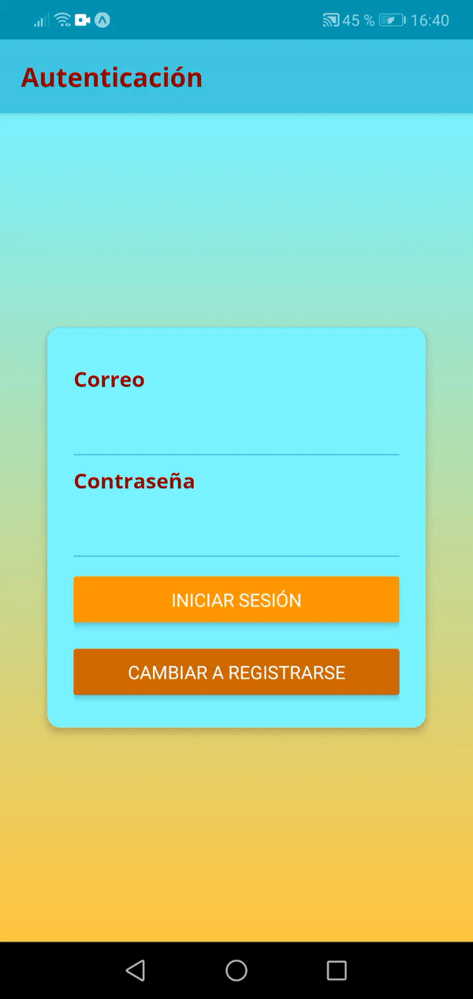

# App Tienda Online

## Descripción
>### Aplicación realizada con React Native consiste una aplicación de Tienda Online con autenticación, el usuario puede exponer sus productos y hacer ordenes de compra

## Gif
### Autenticación

### Creación de Productos

### Ordenes de Compra

## Lo Aprendido
* Implementar formularios de autenticación
* Trabajar con sesiones de autenticación por tokens
* Trabajar con Notificaciónes
* Trabajar con redux thunk para peticiones asíncronas
* Trabajar con firebase para persistencia de datos

## Como Ejecutar
* Ejecuta `cd RN-Tienda-App`
* Ejecuta `yarn install` o `expo install`
* Ejecuta `yarn start` o `expo start`
